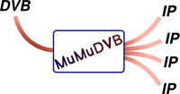



[//]: # ( { width: 200px; } )

## Presentation

MuMuDVB (Multi Multicast DVB) is a program for streaming TV over a network originally based on dvbstream.

MuMuDVB can redistribute a stream from a DVB source (digital satellite television, digital terrestrial television, digital cable television, or ATSC) on a network, in multicast or in HTTP unicast. Its main feature is to take a whole transponder and put each channel on a different multicast group with a simple configuration and improved compatibility with set top boxes. MuMuDVB have a low memory and CPU footprint and is able to run on embedded platforms. Servers with 20+ DVB cards are used sucessfully with MuMuDVB with uptimes > 2 years.

MuMuDVB works under linux and uses the linux DVB API. It's free software, and released under the terms of the GPLv2.

#### Some features:

* hardware descrambling using Conditionnal Access Modules
* software descrambling
* DVB-S2 via linuxtv's S2API
* Automatic detection of the transponder channels, and follow of the transponder changes
* Generation of SAP announces
* Monitoring via webservice
* IPv6 support

For a detailled features list, please refer to the documentation

#### What is multicast ?

IP Multicast is a technique for one to many communication over an IP infrastructure. It scales to a larger receiver population by not requiring prior knowledge of who or how many receivers there are. Multicast utilizes network infrastructure efficiently by requiring the source to send a packet only once, even if it needs to be delivered to a large number of receivers. The nodes in the network take care of replicating the packet to reach multiple receivers only where necessary.

## News

Here is some news (please forgive the emptiness of the new website)

<ul class="posts">
  
    <li>{{ post.date | date_to_string }} &raquo; <a href="{{ BASE_PATH }}{{ post.url }}">{{ post.title }}</a></li>
  
</ul>

# Download

For downloading MuMuDVB please go [here]({{ site.url }}/download/)

# Documentation

How to run it ? How to configure it ? Everything is in the [documentation]({{ site.url }}/documentation/)

# Contact

If you want to [contact us]({{ site.url }}/contact.html)

